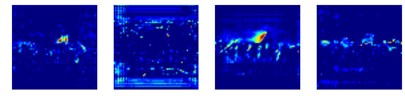
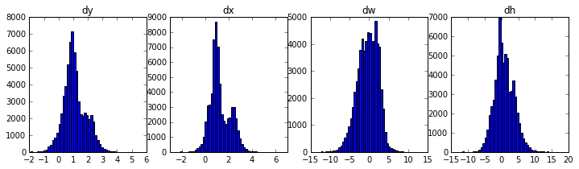

# Sử dụng Faster R-CNN, Mask R-CNN và SSD nhận diện số thẻ ATM

Presentation gồm:
* Kiến trúc mạng Faster R-CNN và demo nhận dạng số thẻ ATM trên Jupyter Notebook
* Kiến trúc mạng Mask R-CNN và demo nhận dạng số thẻ ATM trên Jupyter Notebook
* So sánh Faster R-CNN và Mask R-CNN
* Sử dụng mạng nơ ron trên mobile devices: SSD (Single Shot Detector)
* Demo nhận dạng số thẻ ATM trên điện thoại Android 
* Link tài liệu nghiên cứu

## 1. Kiến trúc mạng Faster R-CNN và demo nhận dạng số thẻ ATM trên Jupyter Notebook
### 1.1. Kiến trúc mạng Faster R-CNN
Faster R-CNN được xây dựng bởi Jian Sun, nhà nghiên cứu của Microsoft, đã thắng cuộc thi ImageNet năm 2015 
(https://blogs.microsoft.com/next/2015/12/10/microsoft-researchers-win-imagenet-computer-vision-challenge/#sm.00017fqnl1bz6fqf11amuo0d9ttdp).

Mùa thu năm 2015, một nhóm nghiên cứu của Microsoft gồm Shaoqing Ren, Kaiming He, Ross Girshick, và Jian Sun, 
đã tìm ra cách cải tiến bước tạo ra region proposal, không dùng giải thuật Selective Search nữa mà sử dụng Region Proposal Network để tạo ra region proposals
- là một Fully Convolutional Network ở trên đỉnh của CNN, CNN có thể là AlexNet hoặc VGG. 
Region Proposal Network dựa trên các đặc trưng của ảnh đã được tính toán trước đó bởi AlexNet. 
Vì vậy, các kết quả đã được tính toán đó sẽ được tái sử dụng thay vì chạy giải thuật Selective Search riêng biệt.  
Một Region Proposal Network nhận đầu vào là ảnh với kích thước bất kì và cho đầu ra là region proposal 
(tập vị trí của các hình chữ nhật có thể chứa vật thể), cùng với xác suất chứa vật thể của hình chữ nhật tương ứng.

Cấu trúc tổng thể của Faster R-CNN là:

Sau khi có Convolutional Feature Maps thì Faster R-CNN sử dụng một Region Proposal Network tách biệt trên top của các convolutional features để dự đoán các region proposals. 

Để tạo ra region proposals, chúng ta sử dụng một network hay còn gọi là cửa sổ trượt (sliding-window) kích thước n×n trượt trên convolutional features. 
Đầu ra của network này là đầu vào của 2 fully-connected layer dự đoán vị trí của regions (box-regression layer), cũng như xác suất chứa object(box-classification) 
của hộp ấy. Tại mỗi vị trí của cửa sổ trượt chúng ta dự đoán đồng thời nhiều region proposal cùng một lúc, với k là số proposal tương ứng với mỗi vị trí. 
Vậy reg layer có 4k đầu ra dự đoán vị trí của k proposal, cls layer chứa 2k.
Các đối tượng sẽ vừa khít với một bounding box có kích thước và tỉ lệ chung. Ví dụ như bounding box cho người thì sẽ là hình chữ nhật theo chiều dọc. 
Theo cách đó, chúng ta tạo ra k tỉ lệ phổ biến (aspect ratios) gọi là anchor boxes. Đối với mỗi anchor box, chúng ta output một bounding box và chấm 
điểm trên toàn bức ảnh.
Tại sao phải tạo ra những anchors này. Theo tôi thì, trong bài toán xác định vị trí vật thể, số lượng đầu ra của mỗi ảnh là khác nhau. 
Ví dụ một bức ảnh có thể có 2 vật thể, một bức ảnh khác có 4 vật thể. Vì số lượng output là không cố định ta phải dựa vào các anchor để cố định hóa số lượng output này. 
Đối với mỗi bức ảnh, ta đều sinh ra các anchors tương ứng phụ thuộc vào kích cỡ của ảnh đó, bằng cách tính giá trị overlap của anchors với ground truth boxes, 
ta có thể xác định được anchors đó là positive hay negative. 

Sau khi đã có đầu ra của các region proposals, chúng ta sẽ tìm hiểu về khái niệm anchors. 
Tại mỗi vị trí của sliding window trên convolutional features, chúng ta tạo ra k anchors tương ứng ở hình ảnh gốc. 
Trong bài báo, tác giả sử dụng 1 hình vuông, 2 hình chữ nhật với tỉ lệ chiều rộng, chiều dài là 1-2, 2-1, cùng với 3 kích cỡ khác nhau, như vậy k=3×3=9. 

Các anchors này sẽ được gán mác là positive hoặc negative dựa vào diện tích overlap với ground truth box theo luật như sau:
* Các anchor được phân loại là positive nếu
* Là anchor có tỉ lệ diện tích chồng chéo trên diện tích chồng chập (Intersection-over- Union - viết tắt IoU) overlap lớn nhất với một ground truth box.
* Là anchor có tỉ lệ IoU với một ground truth lớn hơn 0.7
* Các anchor được phân noại là negative nếu có giá trị IoU bé hơn 0.3
* Các anchor không thỏa mãn 2 điều kiện nêu trên thì bỏ qua. Không được đánh giá trong quá trình training object.

Tại sao phải tạo ra những anchors này? Câu trả lời gồm 2 nguyên nhân chính:
* Dựa phân loại của anchor, để dự đoán xác suất chứa vật thể của các region proposal
* Dựa vào khoảng cách từ anchor đến ground truth box, để dự đoán vị trí của bounding box. 

Từ đây ta xác định được mục tiêu đầu ra của box-regression layer và box-classification:
* Box-classification dự đoán xác suất chứa vật thể của k region proposal, tương ứng với k anchor tại từng vị trí của sliding-window.
* Box-regression dự đoán khoảng cách tư anchor đến ground truth box tương ứng.

### 1.2. So sánh Faster R-CNN với các mạng nơ ron trước đó
 

Fast R-CNN train nhanh hơn R-CNN khoảng 10 lần bởi vì việc chia sẻ các giá trị tính toán giữa các feature maps và test time thì nhanh khủng khiếp. 
Kết quả thực nghiệm đã chỉ ra rằng hầu hết thời gian test là để tính toán tìm ra các region proposals, và với giải thuật Selective Search thì Fast R-CNN 
mất khoảng 2.3 seconds và trong trường hợp Fast R-CNN đã có các region proposals thì việc prediction chỉ chiếm 0.32 seconds. 

Faster R-CNN thực sự rất hiệu quả, chỉ mất 0.2 seconds để dự đoán. Độ chính xác của Faster R-CNN cũng cao hơn Fast R-CNN và R-CNN bởi vì tự tính toán region proposals 
nên sẽ không có sự sai khác giữa predicted proposals với dữ liệu train.

## 2. Kiến trúc mạng Mask R-CNN và demo nhận dạng số thẻ ATM trên Jupyter Notebook
This is an example of final detection boxes (dotted lines) and the refinement applied to them (solid lines) in the second stage.

## 3. So sánh Faster R-CNN và Mask R-CNN
Examples of generated masks. These then get scaled and placed on the image in the right location.

## 4. Sử dụng mạng nơ ron trên mobile devices: SSD (Single Shot Detector)
Often it's useful to inspect the activations at different layers to look for signs of trouble (all zeros or random noise).

## 5. Demo nhận dạng số thẻ ATM trên điện thoại Android
Another useful debugging tool is to inspect the weight histograms. These are included in the inspect_weights.ipynb notebook.

## 6. Link tài liệu nghiên cứu
TensorBoard is another great debugging and visualization tool. The model is configured to log losses and save weights at the end of every epoch.

